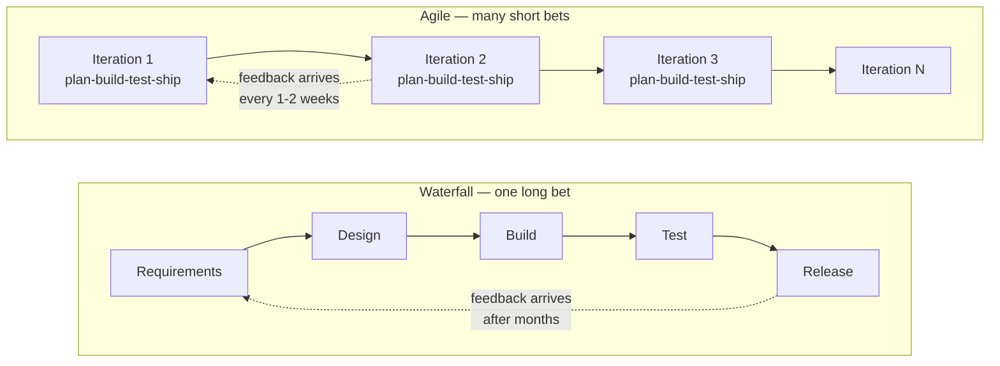
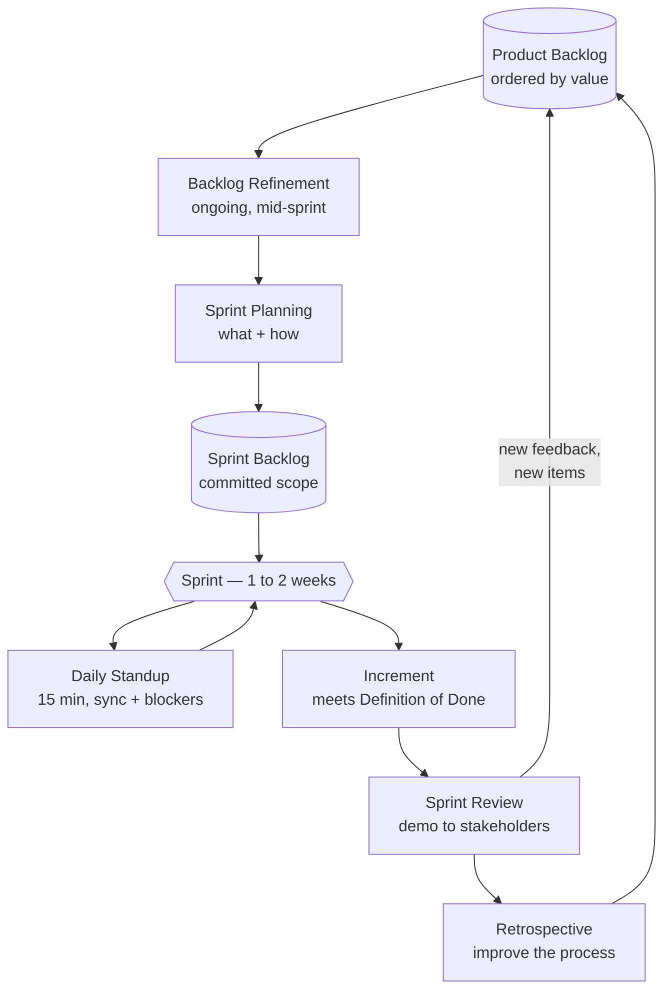
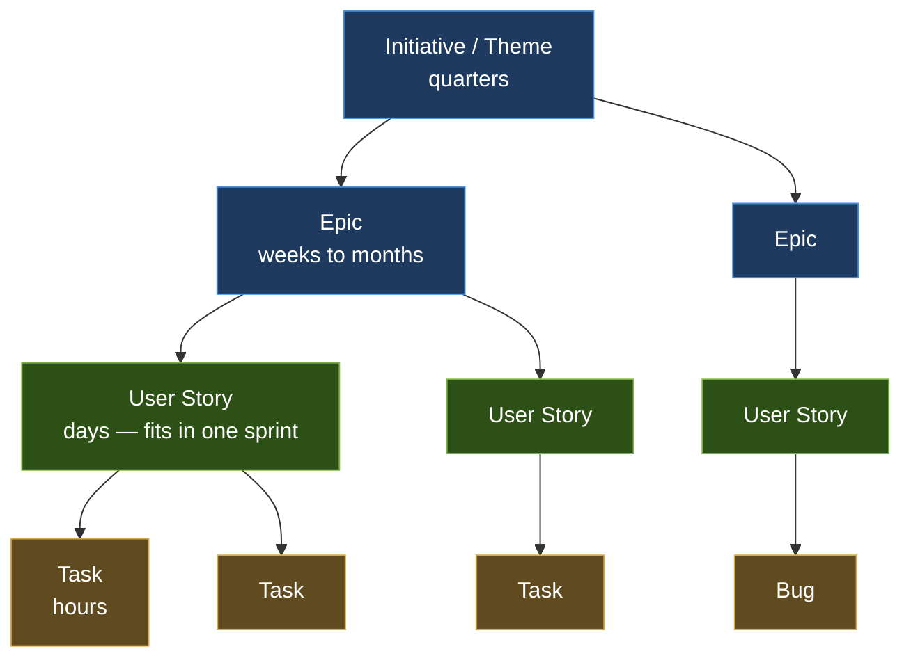
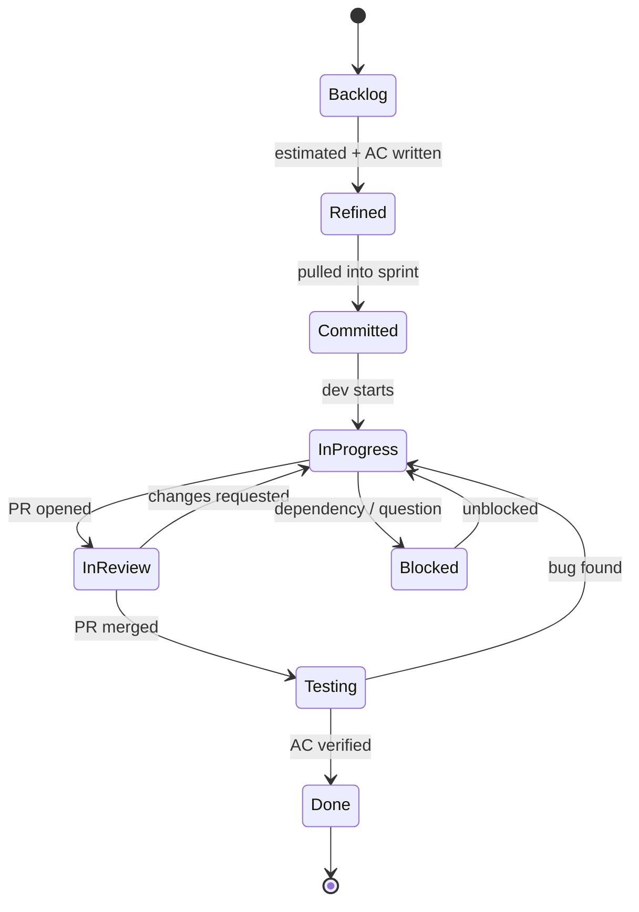
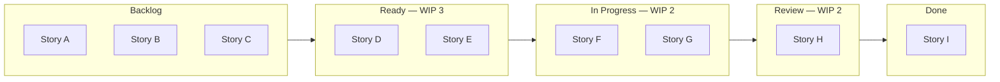
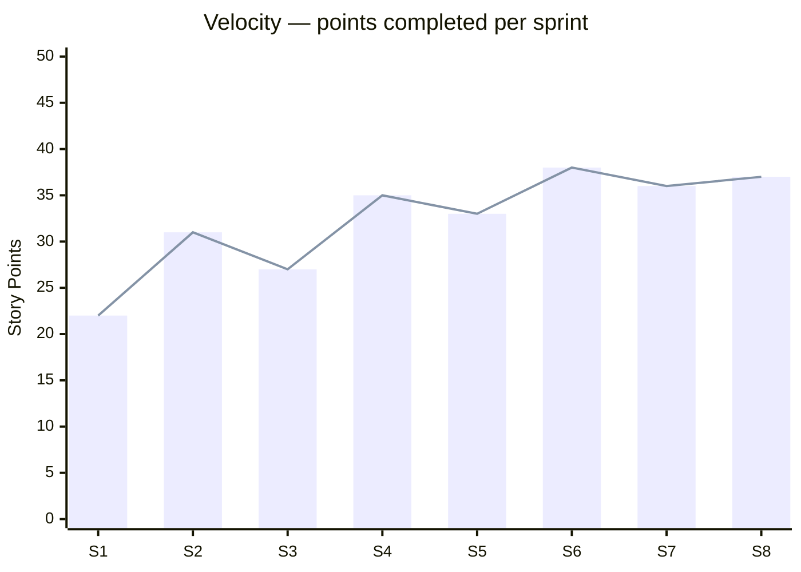
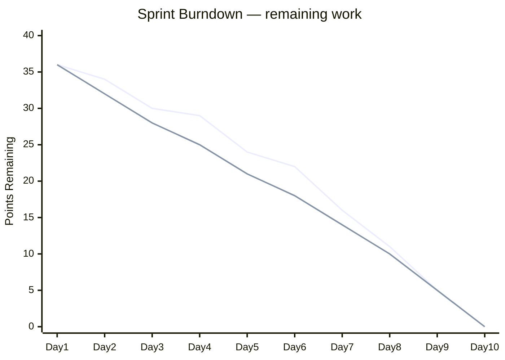
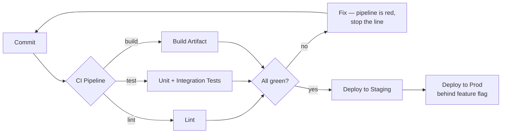
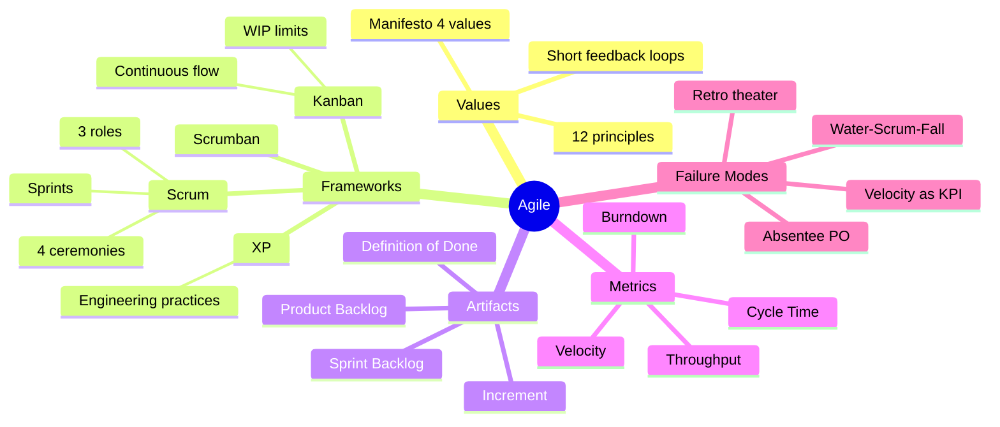

# Agile — A Practical Explanation

> **Authority: none.** Tier 4 `research` is authoritative over nothing. This
> explains general agile practice; it does not specify anything about Plaza.
> Where it and a governed doc disagree, the governed doc wins. Cite it for
> rationale, never as law — the same standing as
> [`aligned-spec-v0.2.5.md`](../../../specs/aligned-spec-v0.2.5.md).
>
> Adopted as foundational onboarding reading for humans and agents alike.

## 1. What Agile Actually Is

Agile is **not** a process. It's a set of values about *how to make decisions under uncertainty* when building software. The concrete processes (Scrum, Kanban, XP) are implementations of those values.

Core premise: **you cannot fully specify software before building it**, because requirements change, users discover what they want by using things, and estimates degrade the further out you look. So instead of one long bet, you make many short bets and correct course after each one.

### The Agile Manifesto (2001) — 4 Values

| We value... | ...over... |
|---|---|
| Individuals and interactions | Processes and tools |
| Working software | Comprehensive documentation |
| Customer collaboration | Contract negotiation |
| Responding to change | Following a plan |

> The right column still has value. The left column has *more* value. That nuance gets lost constantly.

---

## 2. Waterfall vs. Agile — The Structural Difference



**The key difference is feedback latency.** Waterfall discovers it was wrong at the end. Agile discovers it was wrong every two weeks, when correction is cheap.

---

## 3. Scrum — The Most Common Implementation

Scrum is a time-boxed framework. Work happens in fixed-length **Sprints** (usually 1–2 weeks, sometimes 3–4).

### 3.1 Roles

- **Product Owner** — owns the *what* and the *why*. Prioritizes the backlog. Single wringable neck for value.
- **Scrum Master** — owns the *process*. Removes blockers, protects the team from mid-sprint scope injection. Not a manager.
- **Development Team** — owns the *how*. Self-organizing, cross-functional, ideally 3–9 people.

### 3.2 Artifacts

- **Product Backlog** — the ordered list of everything that might get built. Living, always re-prioritized.
- **Sprint Backlog** — the slice the team committed to this sprint. Frozen once the sprint starts.
- **Increment** — the shippable output at sprint end. Must meet the **Definition of Done**.

### 3.3 The Sprint Loop



### 3.4 The Four Ceremonies

| Ceremony | When | Timebox | Purpose |
|---|---|---|---|
| Sprint Planning | Start of sprint | 2–4 hrs | Decide what's in, break into tasks |
| Daily Standup | Every day | 15 min | Sync, surface blockers — **not** a status report to a manager |
| Sprint Review | End of sprint | 1–2 hrs | Demo working software, gather feedback |
| Retrospective | End of sprint | 1 hr | Improve *how the team works*, not what it built |

---

## 4. Work Hierarchy

Big things decompose into small things. Small things get estimated and shipped.



### User Story Format

```
As a <type of user>
I want <some capability>
So that <some benefit>
```

Plus **Acceptance Criteria** — the testable conditions that define "done" for that story. Without AC, a story is a wish.

**INVEST** is the quality checklist for a story:
- **I**ndependent — can ship without waiting on another story
- **N**egotiable — describes intent, not implementation
- **V**aluable — a user or the business gains something
- **E**stimable — the team can size it
- **S**mall — fits comfortably in a sprint
- **T**estable — you can prove it works

---

## 5. Story Lifecycle



The **Blocked** state is the one that matters operationally. A story sitting in Blocked is the single most useful signal a standup produces.

---

## 6. Kanban — The Other Main Flavor

Scrum is **iteration-based**. Kanban is **flow-based** — no sprints, no fixed commitments. Work is pulled continuously, and the control mechanism is **WIP limits** (Work In Progress).



**Why WIP limits work:** if the "In Progress" column is full, you cannot start new work — you must go help finish existing work. This forces the team to optimize for *throughput* rather than *individual utilization*. Little's Law formalizes it:

```
Cycle Time = Work In Progress ÷ Throughput
```

Halve your WIP, halve your cycle time. This is the most counterintuitive and most reliably true thing in Agile.

### Scrum vs. Kanban

| | Scrum | Kanban |
|---|---|---|
| Cadence | Fixed sprints | Continuous flow |
| Commitment | Sprint goal | None — pull as capacity frees |
| Change mid-cycle | Discouraged | Fine, just re-prioritize |
| Key metric | Velocity | Cycle time / throughput |
| Roles | Prescribed | None prescribed |
| Best for | Feature work with planning needs | Support, ops, unpredictable inflow |

Many teams run **Scrumban** — sprints for planning cadence, WIP limits for flow control.

---

## 7. Estimation and Velocity

### Story Points

Relative sizing, not hours. Usually Fibonacci-ish: `1, 2, 3, 5, 8, 13, 21`. Points bundle **complexity + uncertainty + effort**.

Why relative instead of hours: humans are bad at absolute duration estimates and good at comparative ones. "Is this bigger or smaller than that thing we did?" is answerable. "How many hours will this take?" is not.

**Planning Poker** — everyone estimates simultaneously and privately, then reveals. Simultaneity prevents anchoring on the loudest voice. Divergence in estimates means people understand the story differently — that discussion is the actual value, not the number.

### Velocity



Velocity is a **forecasting tool for the team**, not a performance metric for management. The moment velocity becomes a target, teams inflate estimates and the number becomes meaningless. This is Goodhart's Law and it happens with near-total reliability.

### Burndown



Flat line early + cliff at the end = the team is working in parallel and integrating late. That's a smell, not a success.

---

## 8. Engineering Practices That Make Agile Actually Work

Agile without these degrades into "short waterfalls with more meetings." These come mostly from **Extreme Programming (XP)**:

- **Continuous Integration** — merge to main frequently; automated build + test on every push
- **Automated testing** — you cannot iterate fast on code you're afraid to change
- **Refactoring** — continuous, small, safe; not a "refactoring sprint" scheduled for never
- **Trunk-based development / short-lived branches** — long branches recreate the integration problem Agile was meant to solve
- **Definition of Done** — explicit, shared, includes tests + review + deployable
- **Pair programming / mob programming** — optional, but real knowledge distribution
- **Feature flags** — decouple deploy from release, so unfinished work can ship dark



---

## 9. Scaling — Briefly, and With Suspicion

For multiple teams on one product: **SAFe**, **LeSS**, **Nexus**, **Spotify model**.

Honest assessment:
- **LeSS / Nexus** — minimal additions to Scrum, mostly a shared backlog and a joint planning event. Reasonable.
- **SAFe** — heavyweight, a lot of new roles and ceremonies. Popular with enterprises, widely criticized by practitioners as reintroducing the bureaucracy Agile was reacting against. Sometimes it's genuinely what a 500-person org needs.
- **Spotify model** — squads/tribes/chapters/guilds. Famously, Spotify itself doesn't use it as described; it was a snapshot of one moment, not a framework.

General rule: scaling frameworks solve *coordination* problems. If your problem is actually unclear ownership or bad architecture, no framework fixes it. Conway's Law dominates — your system architecture will mirror your team structure whether you plan it or not.

---

## 10. Common Failure Modes

| Anti-pattern | What it looks like | Underlying cause |
|---|---|---|
| **Water-Scrum-Fall** | Big upfront requirements, sprints in the middle, one release at the end | Org didn't change, only the dev team did |
| **Zombie standups** | Round-robin status reports to the Scrum Master | Standup treated as reporting, not coordination |
| **Velocity as a KPI** | Management tracks points per person | Metric turned into target |
| **No Definition of Done** | "Done" means merged, then QA finds it 3 sprints later | Undefined quality bar |
| **Retro theater** | Same issues raised every sprint, nothing changes | No action items with owners |
| **Backlog as a landfill** | 800 items, nothing ever deleted | No one grooms or prunes |
| **Scope injection** | PO adds work mid-sprint | Scrum Master not protecting the sprint |
| **Absentee Product Owner** | Devs guess at requirements | PO role given to someone with no time or authority |

---

## 11. When Agile Is the Wrong Choice

Agile assumes requirements are uncertain and iteration is cheap. When that's not true, it fits poorly:

- **Hard regulatory / safety-critical** — avionics, medical devices, where upfront verification is legally required
- **Fixed-scope fixed-price contracts** — the contract structure fights the methodology
- **Genuinely well-understood work** — a straightforward migration with a known destination doesn't need iterative discovery
- **Solo or two-person projects** — most of the ceremony is coordination overhead you don't have

---

## 12. Summary



**The one-sentence version:** ship small slices of working software frequently, show them to real users, and let what you learn reorder what you build next.

**The thing most teams get wrong:** they adopt the ceremonies and skip the engineering practices, then wonder why iterating still hurts.
